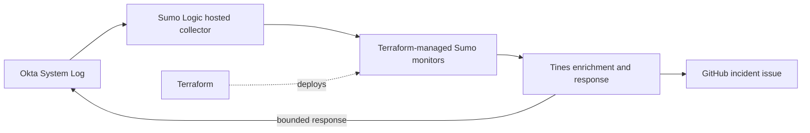

# Detection as Code — Okta proof of concept

Terraform-managed Sumo Logic detections for Okta, with Tines orchestration and structured GitHub incident records.

## Detections

| Playbook | Detection | Severity and response |
| --- | --- | --- |
| PB-100 | Successful administrator-role grant to an identity outside the approved `admin.*` naming convention | High. Create an incident, revoke the matching target's sessions and tokens, and suspend the target under the bounded proof-of-concept response policy. |
| PB-200 | Successful OAuth-client creation with an unapproved redirect URI | Medium base. Tines raises the assessment to High when the application is active and refresh-token capable, then deactivates the matching application. |

## Response model

- Alerting and containment are deliberately separated. A detection always creates an incident, while Tines takes an automated Okta action only when the relevant user or OAuth application also meets the defined response conditions.
- Only events that meet the suspicious criteria and the bounded response policy can reach an Okta action; other matches still create an incident.
- The administrator who performed the role grant is never automatically suspended in this proof of concept.
- Suspension or application deactivation is preferred to deletion because it is reversible and supports investigation while limiting disruption.
- Every incident records the severity rationale, expected false positive, MITRE ATT&CK mapping and investigation playbook.

## Repository guide

- [Sumo-to-Tines data contract](docs/data-contract.md)
- [Detection tuning record](docs/tuning-log.md)
- `rule_okta_administrator_role_assigned_to_non_admin_user_account.tf` — PB-100 query and incident metadata
- `rule_okta_new_application_requires_redirect_review.tf` — PB-200 query and incident metadata
- `modules/sumo_monitor` — reusable Sumo monitor module

## Security and publication checks

- Live access IDs, access keys, API tokens, client secrets and webhook URLs are not committed.
- Sensitive values are supplied at runtime through Terraform variables and managed credentials in Tines.
- Local state, plan files, environment files and test evidence are excluded through `.gitignore`.
- The publication tree is checked for common token, private-key, webhook and credential patterns before release.
