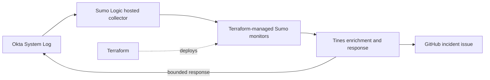

# Okta Detection as Code with Terraform, Sumo Logic and Tines

Author: Matthew Davies

A practical example showing how identity-security detections can be versioned, reviewed and deployed as code. The project uses Terraform to manage Sumo Logic monitors for Okta activity, publishes structured alert context to Tines, and demonstrates policy-gated incident response through GitHub and Okta.

## What this repository demonstrates

- Managing detection logic and metadata through Git.
- Deploying consistently configured Sumo Logic monitors with a reusable Terraform module.
- Passing a documented alert contract from the SIEM to an orchestration workflow.
- Separating detection from automated response decisions.
- Recording severity rationale, expected false positives, MITRE ATT&CK mappings and investigation guidance alongside each rule.
- Documenting tuning decisions and secure handling of credentials.

## Detections

| Playbook | Detection | Severity and response |
| --- | --- | --- |
| PB-100 | Successful administrator-role grant to an identity outside the approved `admin.*` naming convention | High. Create an incident, revoke the matching target's sessions and tokens, and suspend the target only when the defined response safety conditions are satisfied. |
| PB-200 | Successful OAuth-client creation with an unapproved redirect URI | Medium base. Tines raises the assessment to High when the application is active and refresh-token capable, then deactivates the matching application. |

PB-100 maps to the Persistence (`TA0003`) and Privilege Escalation (`TA0004`) tactics, using Account Manipulation (`T1098`) and Additional Cloud Roles (`T1098.003`).

## Design decisions

- Detection and response are deliberately separated. Sumo identifies relevant activity; Tines performs enrichment and applies the response safety conditions.
- Every qualifying detection creates a structured investigation record, but an automated Okta action requires additional checks against the affected user or application.
- By design, the administrator who performed the role grant is not automatically suspended from this signal alone.
- Suspension or application deactivation is preferred to deletion because it is reversible and supports investigation while limiting disruption.
- Detection metadata includes a severity rationale, expected false positive, MITRE ATT&CK mapping and investigation guidance.

## Repository guide

- [Sumo-to-Tines data contract](docs/data-contract.md)
- [Detection tuning record](docs/tuning-log.md)
- `rule_okta_administrator_role_assigned_to_non_admin_user_account.tf` — PB-100 query and incident metadata
- `rule_okta_new_application_requires_redirect_review.tf` — PB-200 query and incident metadata
- `modules/sumo_monitor` — reusable Sumo monitor module

## Adapting the example

An implementation using this repository should:

1. Replace the example Okta source category with the organisation's Sumo source category.
2. Review the Okta field mappings against representative tenant events.
3. Replace example identity exclusions with a governed exception source.
4. Define the organisation's approved OAuth redirect inventory.
5. Supply Sumo credentials and webhook endpoints through managed secrets.
6. Test every detection and response path in a non-production environment before enabling containment.

## Production considerations

For a larger deployment, the implementation would be extended with:

- Per-event processing rather than selecting a single representative result from a monitor window.
- Persistent tracking of successfully processed event identifiers and retry handling.
- Governed lookup data for approved identities and redirect domains.
- Automated positive, negative and regression tests.
- Telemetry-health monitoring for missing events, delayed ingestion and field-quality changes.
- Remote Terraform state, state locking and environment-specific configuration.

## Security handling

- Live access IDs, access keys, API tokens, client secrets and webhook URLs are not committed.
- Sensitive values are supplied at runtime through Terraform variables and managed credentials in Tines.
- Local state, plan files, environment files and test evidence are excluded through `.gitignore`.
- The publication tree is checked for common token, private-key, webhook and credential patterns before release.
